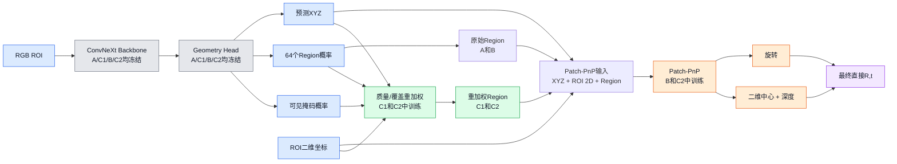
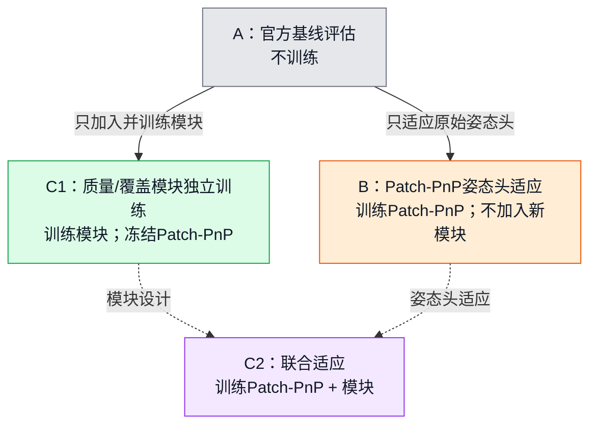

# Stage 3C 实验信息看板

最后更新：2026-08-05
结果截止：C1 Epoch 40（正式完成）

本文件是用于快速查看的简洁状态页。正式协议和证据链接见
[实验记录与协议](#实验记录与协议)。

## 当前状态

```text
当前实验：B/C2运行门准备
当前进度：C1预注册40轮和最终评估已完成
当前判断：C1_SCREEN_FAIL
当前最佳：Epoch 5，但仍未通过BOP与ADD门槛
后续安排：物理GPU0运行B，物理GPU1运行C2；启动前分别通过运行门
正式种子：20260731；每个正式实验只使用一个固定种子
```

## 实验定义

| 编号 | 实验名称 | 训练模块 | 实验目的 | 当前状态 |
|---|---|---|---|---|
| A | 官方基线评估 | 无 | 提供所有后续实验的统一参考指标 | 已完成 |
| C1 | 质量/覆盖模块独立训练实验 | 质量/覆盖模块 | 判断冻结Patch-PnP时，仅调整region特征是否有效 | 正式完成；失败 |
| B | Patch-PnP姿态头适应实验 | Patch-PnP | 判断原始姿态头重新适应是否足够 | 已触发；运行门准备 |
| C2 | Patch-PnP＋质量/覆盖联合适应实验 | Patch-PnP和质量/覆盖模块 | 判断模块是否需要联合适应及其相对B的额外贡献 | 已触发；运行门准备 |

保留编号是为了兼容现有协议和输出目录。文档首次提到实验时，应同时写出编号和
完整实验名称。

## 模块训练矩阵

| 网络模块 | A：官方基线 | C1：模块独立训练 | B：姿态头适应 | C2：联合适应 |
|---|---:|---:|---:|---:|
| ConvNeXt backbone | 冻结 | 冻结 | 冻结 | 冻结 |
| Geometry head | 冻结 | 冻结 | 冻结 | 冻结 |
| 质量/覆盖模块 | 不存在 | 训练 | 不存在 | 训练 |
| Patch-PnP | 冻结 | 冻结 | 训练 | 训练 |
| 最终姿态 | 直接`R,t` | 直接`R,t` | 直接`R,t` | 直接`R,t` |

## 当前结果

| 实验/检查点 | BOP AR (%) | ΔAR (pp) | ADD(-S)@0.1d (%) | ΔADD(-S) (pp) | 非负物体 | 判断 |
|---|---:|---:|---:|---:|---:|---|
| A：官方基线评估 | 69.0415 | — | 50.86 | — | — | 基线 |
| C1：模块独立训练，Epoch 5 | 69.0242 | -0.0173 | 51.00 | +0.14 | 7/8 | 当前最佳；未通过 |
| C1：模块独立训练，Epoch 10 | 68.9624 | -0.0791 | 50.36 | -0.50 | 5/8 | 未通过 |
| C1：模块独立训练，Epoch 15 | 68.9836 | -0.0579 | 50.79 | -0.07 | 6/8 | 未通过 |
| C1：模块独立训练，Epoch 20 | 68.9933 | -0.0482 | 50.43 | -0.43 | 4/8 | 暂定失败 |
| C1：模块独立训练，Epoch 25 | 68.9813 | -0.0602 | 50.94 | +0.08 | 5/8 | 暂定失败 |
| C1：模块独立训练，Epoch 30 | 68.9670 | -0.0745 | 50.37 | -0.49 | 4/8 | 暂定失败 |
| C1：模块独立训练，Epoch 35 | 68.9751 | -0.0664 | 50.59 | -0.27 | 4/8 | 暂定失败 |
| C1：模块独立训练，Epoch 40 | 68.9742 | -0.0674 | 50.57 | -0.29 | 4/8 | 正式失败 |
| B：姿态头适应实验 | 待执行 | — | 待执行 | — | — | 已触发 |
| C2：联合适应实验 | 待执行 | — | 待执行 | — | — | 已触发 |

冻结的通过门槛为：

- BOP AR至少提高`+0.50 pp`；
- ADD(-S)@0.1d至少提高`+1.00 pp`；
- 至少`5/8`物体非负。

三项必须全部通过。C1固定Epoch 40三项均未通过；其最佳Epoch 5也未通过
BOP和ADD门槛，因此最终结论为`C1_SCREEN_FAIL`。

<details>
<summary>C1 Epoch 20逐物体ADD(-S)@0.1d</summary>

| 物体 | 官方基线 (%) | Epoch 20 (%) | 差值 (pp) |
|---|---:|---:|---:|
| ape | 49.14 | 48.00 | -1.14 |
| can | 80.90 | 81.41 | +0.51 |
| cat | 47.37 | 45.61 | -1.76 |
| driller | 82.50 | 82.00 | -0.50 |
| duck | 8.89 | 8.33 | -0.56 |
| eggbox | 41.11 | 41.11 | 0.00 |
| glue | 75.00 | 75.00 | 0.00 |
| holepuncher | 22.00 | 22.00 | 0.00 |

```text
source log: E:\6D姿态估计\26-08-02\26-08-03-20epoch.log
SHA-256:   fe5643ece26f69767488662e2a78611e0ca888e41e058d2d167478dcdf432f2e
```

</details>

<details>
<summary>C1 Epoch 25逐物体ADD(-S)@0.1d</summary>

| 物体 | 官方基线 (%) | Epoch 25 (%) | 差值 (pp) |
|---|---:|---:|---:|
| ape | 49.14 | 50.86 | +1.72 |
| can | 80.90 | 81.41 | +0.51 |
| cat | 47.37 | 46.78 | -0.59 |
| driller | 82.50 | 83.00 | +0.50 |
| duck | 8.89 | 9.44 | +0.55 |
| eggbox | 41.11 | 40.00 | -1.11 |
| glue | 75.00 | 75.00 | 0.00 |
| holepuncher | 22.00 | 21.00 | -1.00 |

```text
source log: E:\6D姿态估计\26-08-02\26-08-03-25epoch.log
SHA-256:   b92e56587dd7b7e173d2041240dc399fbb1b1fd3a7cda2464edb7a2c54022410
```

</details>

<details>
<summary>C1 Epoch 35逐物体ADD(-S)@0.1d</summary>

| 物体 | 官方基线 (%) | Epoch 35 (%) | 差值 (pp) |
|---|---:|---:|---:|
| ape | 49.14 | 48.57 | -0.57 |
| can | 80.90 | 80.90 | 0.00 |
| cat | 47.37 | 46.78 | -0.59 |
| driller | 82.50 | 82.00 | -0.50 |
| duck | 8.89 | 8.89 | 0.00 |
| eggbox | 41.11 | 40.56 | -0.55 |
| glue | 75.00 | 75.00 | 0.00 |
| holepuncher | 22.00 | 22.00 | 0.00 |

```text
source log: E:\6D姿态估计\26-08-02\26-08-04-35epoch.log
SHA-256:   b07f5d9dfe56da86a33001bcf1107fc0d4a8cccdbb907be55818d0bcd5d8292d
```

</details>

<details>
<summary>C1 Epoch 40逐物体ADD(-S)@0.1d</summary>

| 物体 | 官方基线 (%) | Epoch 40 (%) | 差值 (pp) |
|---|---:|---:|---:|
| ape | 49.14 | 49.14 | 0.00 |
| can | 80.90 | 80.90 | 0.00 |
| cat | 47.37 | 46.78 | -0.59 |
| driller | 82.50 | 82.00 | -0.50 |
| duck | 8.89 | 8.89 | 0.00 |
| eggbox | 41.11 | 40.56 | -0.55 |
| glue | 75.00 | 74.29 | -0.71 |
| holepuncher | 22.00 | 22.00 | 0.00 |

```text
source log: E:\6D姿态估计\26-08-02\26-08-05-40epoch.log
SHA-256:   a7333b54f64aa9effd2f14677f047560727d489a9e5b0987a6bc70bdf7a5009a
checkpoint SHA-256: d3ab7167f2fc5f6aab8d7e8444c5b816036bd64e38f647a26e994c8e91939aa6
本地副本: E:\6D姿态估计\26-08-02\model_0255919.pth
核验: 本地副本与服务器固定Epoch 40权重SHA-256一致
```

</details>

## 统一网络结构



图中同时画出两条region路径：A和B使用原始region旁路；C1和C2使用质量/覆盖
模块重加权后的region。

## 实验关系



虚线表示受控设计关系，不表示checkpoint继承。B和C2都从官方checkpoint独立初始化。

## 受控比较

| 比较 | 回答的问题 |
|---|---|
| B姿态头适应实验相对A官方基线 | 原始Patch-PnP重新适应是否有效 |
| C1模块独立训练实验相对A官方基线 | 模块在Patch-PnP冻结时是否有效 |
| C2联合适应实验相对B姿态头适应实验 | 模块在姿态头适应后是否有额外贡献 |
| C2联合适应实验相对A官方基线 | 联合方案的总收益是多少 |

传统EPnP、RANSAC、IRLS和固定步优化只作为诊断或上限参考，不是候选最终网络路径。

## 实验记录与协议

- [研究交接](HANDOFF.md)
- [C1正式协议](stages/STAGE_03C1_QUALITY_COVERAGE_ATTENTION.md)
- [C1实验记录](experiments/EXP-20260731-006-quality-coverage/RECORD.md)
- [B姿态头适应协议](stages/STAGE_03C0_PNP_ADAPTATION_CONTROL.md)
- [B本地试运行记录](experiments/EXP-20260731-005-pnp-only-control/RECORD.md)
